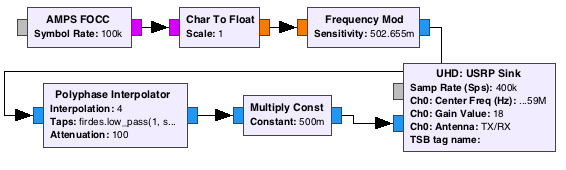
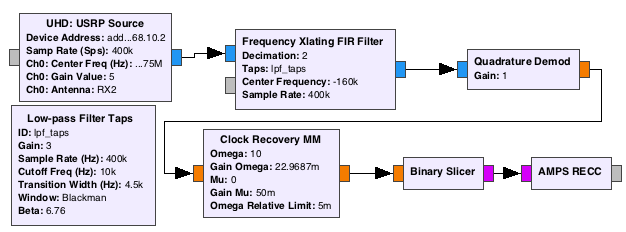
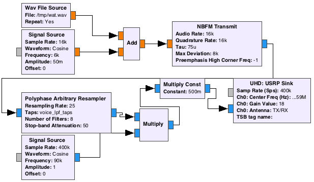
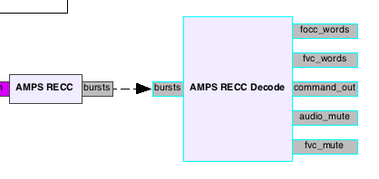

# Dig Out Your Brick Phone! Bringing AMPS back with GNU Radio

# Abstract

AMPS (Advanced Mobile Phone Service), the US's first widely-deployed cellular network, is a useful case study in real-world mobile system engineering.  Constrained to the technology of late-1970s portable electronics, it designers shipped an incredibly simple, though insecure, technology relative to contemporary 3G/4G systems.  Nevertheless, the design served millions of people reliably for decades.  AMPS's initial lack of security gave phreaks and reverse engineers an exciting playground during its heyday; I decided to pay my homage by bringing a bit of it back to life.

This presentation[^1] outlines the design and implementation of gr-amps[^2], an open-source set of GNU Radio blocks and flowgraphs that can implement a proof-of-concept AMPS base station using a software-defined radio.

# AMPS In A Nutshell

Mobile system engineers make difficult design tradeoffs. For example: additional complexity in the protocol risks increasing the device cost; using more spectrally-efficient modulation schemes frees up more channels for use, but might require more pricey or power-hungry RF circuitry, or decrease performance.  

AMPS was often popularly called "analog", because the voice audio was transmitted using FM.  However, all signaling was digital, using 10kbit/s 2-FSK modulation with 8kHz deviation and Manchester encoding (20k symbols/second).

## From Scratch: Approach and Previous Research

Since AMPS was decommissioned rapidly after the US FCC's 2008 sunset date[^5], I wasn't able to compare my progress against a real base station's transmission.  I worked instead from standards, textbooks, and other descriptions of the system.

My main reference was the standard describing the communications between the mobile station (MS; a.k.a. the phone) and the base station (BS, a.k.a. the tower).  The latest version of this is TIA/EIA-553-A-1999[^6].  The bulk of the earlier version (IS-3), however, can be found in the free Canadian standard RSS 118 (Annex A)[^7].  

These standards are surprisingly readable; but even friendlier introductions to AMPS can be found in two Phrack articles by Brian Oblivion [^8] [^9] and several large textbooks that are relatively inexpensive in 2017 [^10] [^11].  Details on handsets can be found by perusing archives like textfiles.com[^4].

## AMPS Channels

AMPS operated in the 800MHz band. The uplink (MS->BS) was 824-849 MHz; the downlink was 869->894 MHz.  These bands are divided into *channels* with unique numbers. Each channel number identifies a 30kHz-wide channel in the uplink (*reverse channel*) and (45 MHz offset) in the downlink (*forward channel*).  The frequencies of both can be calculated from the channel number.

For example, the center frequency of channel 334's forward channel (from BS to phone(s)) is 880.02, while the center frequency of the reverse channel (transmitted from phone to BS) is 45MHz below at 835.020.

There are two channel types: control channels and voice channels.  

### Control Channels

On a forward control channel, the base station beacons information about itself (e.g. the network it belongs to, configuration parameters) and sends commands to phones.  When a phone is powered on and idle, it's tuned to one of these channels, waiting for a call or other command. 

On reverse control channels, base stations listen for messages from phones -- registrations, requests to make a call, and so on.  These channels are shared, which means that there is the possibility for phones' broadcasts to interfere with each other.  AMPS attempts to mitigate this by periodically broadcasting an idle-channel indicator on the forward control channel. 

### Voice Channels

Voice channels actually carry both voice and data transmissions, though not both at the same time.  They use *blank-and-burst* in-band signaling.  When a ~6kHz tone (called the SAT Tone) is present in the FM signal, then the transmission contains audio; when it's not present, 2-FSK data bursts will be sent.  BSes can send a wider variety of commands to individual phones over the forward control channel; those messages are not required to be transmitted on a global control channel.  (This reduces congestion on the control channels.)

In addition to the SAT tone, a 10kHz signaling tone can be sent to indicate other conditions (flash, hangup requested, etc.).

### Basic Procedure Outline: Example

When the BS needs to inform a phone of an incoming call, it sends a "Page" message over the forward control channel to that MS, directing the MS to a specific voice channel.  After the MS acknowledges this (over the reverse control channel) and tunes to the channel, the BS then sends additional commands (such as the Alert message, which tells the phone to ring) over the voice channel.  After both sides of the call are connected, the SAT tones are transmitted from both sides, and the users can speak to each other.  

While a call is in progress, the BS can still send commands to the MS (like a handoff to another tower); to accomplish this, the tower stops sending the SAT tone, causing the phone to cut off the audio to the user. (In practice, the audio cutoff wasn't perfect on many devices, and it wasn't uncommon for users to hear these short bursts.)

# Implementation Details

Gr-amps is built from channel-specific data blocks that generate or receive on data streams.   The flowgraph for a forward control channel transmission would look like this:

This approach is a bit of a hack.  The source blocks are not emitting 0 and 1 symbols; they're emitting -1 and 1.  In the FM block, the sensitivity is multiplied by the deviation (in this case, sensitivity = `2.0 * math.pi * max_deviation / symbol_rate`). In other words, sending a -1 briefly sends the carrier `max_deviation` (8kHz) below the center; sending a 1 modulates the carrier above.  After filtering and resampling, the output can be sent to an SDR sink.  

## Receive Path

To receive data from the MSes on the reverse control channel, use the GNU Radio "Clock Recovery MM" block (an implementation of the Mueller & Mueller algorithm[^12]) to synchronize against the transmissions and emit a stream of symbols.  The gr-amps RECC block receives these, performs Manchester decoding, and looks for the start of a valid message.

## Voice Channels

Voice channels present a challenge since they're not pure data. My initial approach involves two parallel streams toggled with Mute blocks; one data stream like the above, and one audio stream.  Here's what the audio transmission from a looping WAV file looks like -- note the 6kHz SAT tone mixed in:

## Modularity and Messages

Apart from the source and sink blocks, much of the logic in implementing call workflow lives in a block called "AMPS RECC Decode", which asynchronously handles PMT messages [^13], not samples.  When a valid message has been recovered by the RECC block, it sends it off to a queue in the Decode block.  This then decides what to do with it; it can send messages out to the FOCC block for later sending, send debugging messages out, and more.  

Similarly, to provide a bit of interactivity, gr-amps also includes a command-processor block that implements a rudimentary command-line interface when connected to (e.g.) a TCP Socket PDU block.

# Current Functionality

While the low-level blocks are present, only a limited set of functionality is available in the existing flowgraphs.  Out of the box, gr-amps can:

* Provide a valid FOCC (including one that aggressively entices MSes to register frequently)
* Receive and respond to RECC messages, including Origination ("I'd like to make a call, please.")
* Page and alert ("ring") an MS, either from a CLI command or from a mobile-originated call
* Play (static) audio over the voice channels

In the repository you can find experiments that include connecting the audio between two voice channels, but these are not particularly reliable yet. 

Development is ongoing, though bursty.

# More Notes

For a more detailed view of the above, see the presentation slides with presenter notes.

If you're interested in AMPS, also take a look at osmocom-analog[^3].  This is an AMPS BS implementation that does not use SDR, but generates/receives audio for existing transmitters and receivers.

# Acknowledgements

Numerous members of the Ninja Networks team helped out in providing material (old phones) and moral support.  

The GNU Radio team deserves tremendous credit for building a toolkit flexible enough to enable and facilitate experiments like this and many others.

Finally, thanks to ShmooCon for hosting this presentation.

# References

[^1]: Presentation content (Keynote and PDF files): [https://github.com/unsynchronized/gramps-shmoocon-2017](https://github.com/unsynchronized/gramps-shmoocon-2017)

[^2]: gr-amps main repository: [https://github.com/unsynchronized/gr-amps](https://github.com/unsynchronized/gr-amps)

[^3]: osmocom-analog: [http://osmocom-analog.eversberg.eu/](http://osmocom-analog.eversberg.eu/)

[^4]: CELLULAR section, textfiles.com. [http://www.textfiles.com/phreak/CELLULAR/](http://www.textfiles.com/phreak/CELLULAR/)

[^5]: Ziegler, Chris. "Analog cellular networks, R.I.P.: 1983-2008", Engadget, 2008-02-18. [https://www.engadget.com/2008/02/18/analog-cellular-networks-r-i-p-1983-2008/](https://www.engadget.com/2008/02/18/analog-cellular-networks-r-i-p-1983-2008/)

[^6]: TIA TR-45.1. "Mobile Station - Base Station Compatibility Standard". ANSI TIA/EIA-553-A-1999. 1999-10-14. [http://download.eversberg.eu/mobilfunk/AMPS-Docs/TIA_EIA_553_A.pdf](http://download.eversberg.eu/mobilfunk/AMPS-Docs/TIA_EIA_553_A.pdf)

[^7]: Innovation, Science, and Economic Development Canada. "Annex A: Cellular System Mobile Station - Land Station Compatibility Standard." RSS 118 (Annex A).  1983-10-22. [https://www.ic.gc.ca/eic/site/smt-gst.nsf/vwapj/rss118annex.PDF/$FILE/rss118annex.PDF](https://www.ic.gc.ca/eic/site/smt-gst.nsf/vwapj/rss118annex.PDF/$FILE/rss118annex.PDF)

[^8]: Oblivion, Brian. "Cellular Telephony". [Phrack 38, file 9](http://phrack.org/issues/38/9.html#article)

[^9]: Oblivion, Brian. "Cellular Telephony Part II". [Phrack 40, file 6](http://phrack.org/issues/40/6.html#article)

[^10]: van Bosse, John G. & Fabrizio U. Devetak. "Signaling in Telecommunication Networks", 2nd ed. Chapter 12 is a good place to start.

[^11]: Miceli, Andrew. "Wireless Technician's Handbook", 2nd ed.

[^12]: Avian's Blog. "Notes on M&M Clock Recovery" [https://www.tablix.org/~avian/blog/archives/2015/03/notes_on_m_m_clock_recovery/](https://www.tablix.org/~avian/blog/archives/2015/03/notes_on_m_m_clock_recovery/)

[^13]: GNURadio Wiki. "Tutorial: Programming Topics" [http://gnuradio.org/redmine/projects/gnuradio/wiki/Guided_Tutorial_Programming_Topics](http://gnuradio.org/redmine/projects/gnuradio/wiki/Guided_Tutorial_Programming_Topics)

# Metadata

**Primary Author Name**: Brandon Creighton a.k.a. cstone

**Primary Author Affiliation**: Veracode, Ninja Networks

**Primary Author Email**: cstone at pobox dot com
