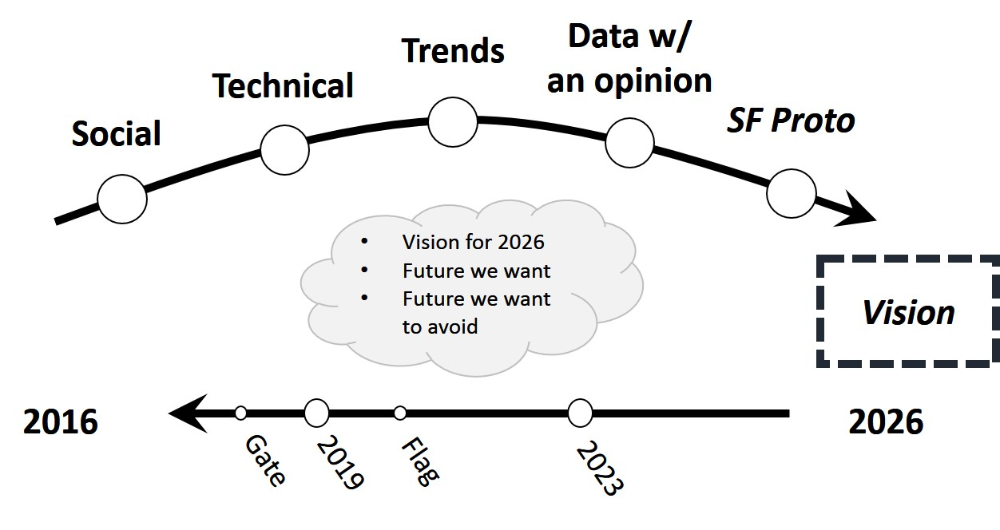

# Threatcasting 2026: A Widening Attack Plain

# Abstract

A glimpse of our digital future includes diverse actors operating on a widening attack plain with affects ranging from data disruption to death and destruction. How do we craft meaningful narratives of the future that can advise our community today? How do we combat the weaponization of data and future technology? Where do we even start? 

Threatcasting is a conceptual framework and process that enables multidisciplinary groups to envision and systematically plan against threats ten years in the future. In August 2016, the Army Cyber Institute convened a cross section of public, private and academic participants to model future digital threats using this process with inputs from social science, technical research, cultural history, economics, trends, expert interviews and even a little science fiction. Renowned futurist Brian David Johnson and Army Major Natalie Vanatta will explore the results of this project that not only describes tomorrow’s threats but also identifies specific actions, indicators and concrete steps that can be taken today to disrupt, mitigate and recover from these future threats.

# Content

On August 2016, twenty-five participants from government, military, academia, and industry gathered for two days to participate in a threatcasting workshop to formulate possible future cyber threats.  Threatcasting is a conceptual framework and process that enables multidisciplinary groups to envision and plan in a systematic fashion against threats ten years in the future and what organizations can do to disrupt, mitigate and recover from these threats.

The goal of the threatcasting and backcasting process was to first model future cyber threats as dictated by curated technology, culture and business trends while exploring the implications on the Army Cyber Institute (ACI), Army, DoD (Department of Defense) and wider participants (e.g. public and private organizations, academic, general public, etc.).  Our second goal was to come up with clear next steps that the Army could take as an organization to get the combined positive future that we modeled, while avoiding any negative futures. 

Based upon the technological, cultural and economic shifts and advances in the next decade we begin to see an evolving threat landscape emerging.  This new reality of cyber and data security can be seen as a widening attack plain.  The attack surface in the future broadens out, including more people, increasing targets, and changing the very nature of security and threat.

The cyber threats over the last decade have mainly been isolated to “data only” threats, espionage, leaks and hacks.  In recent years, the nature of these attacks have expanded to include micro-targeting, cyber-physical and cyber-kinetic attacks.  In the next decade we will see a continuing widening of the attack plain.

As we look at the future of cyber threats, we must look beyond the current digital attack surface and see a plain that is far wider and exposed.  The nature of hacking and cyber itself will become another tool or weapon that can be used alone or with more frequency as a blended attack.  These blended attacks provide the most potential for devastating offense and increased complexity for the defense.  

## Future Threats and Actions

### Threat: War on Reality: The Weaponization of Data and AI

Autonomous systems depend upon data to construct a model of the physical world.  If this data is corrupted or deliberately manipulated, these highly automated systems could not be living in the same reality as we are.   The information into these systems can be altered, falsified, spoofed and manipulated to not only affect the system but weaken or destroy it.  The greater use of autonomy also means that this weaponized data can quickly move effects from the digital or cyber domain to the social, physical and/or kinetic realms.

Artificial Intelligence (AI) will be the backbone of these complex autonomous systems, allowing them to operate and make decisions.  But the weaponization of AI also means that AI can be used as a part of these blended attacks.

At the same time, AI can also be used to monitor this expanded attack plain, looking for vulnerabilities and either prompting or taking autonomous action on its own.  For example, an attack might take place by a third party.  A hacktivist takes down a system as a form of protest.  But then a state sponsored or criminal network using AI could identify this un-associated action as it opens a window or vulnerability that they want to exploit.  In this way a completely unrelated and unknowing actor could work to further the desired outcome of another party.  AI and these highly automated complex systems become a key component in these blended attacks because the actors on their own will not be able to monitor the entire attack plain. 

### Threat: Efficiency is Easy to Hack: Vulnerabilities of Complex Automated Systems

There are few regulations that govern the use of AI and automation.  Globally there is no norm or accepted practice for human oversight of these systems or how the “human remains in or on the loop.” The biggest vulnerability of these systems is the very thing that will promote their use and adoption: efficiency.  Market forces and business management reward efficiency, whether this is cutting costs or increasing production; both efficiency and productivity are highly valued.

As these systems undergo a wave of automation with efficiency as the driving factor, for threat actors these systems become increasingly easy to attack.  Stated simply: Efficiency is easy to hack.

If the threat actor knows how the system is constructed, what it values and what it has been optimized for - then they can use both the weaponization of data and the use of AI to hijack and even use these systems as a part of the attack.

Additionally, these systems are designed with security as an afterthought, with a lack of understanding of the critical nature regarding the welfare and security of the country.  In fact, many of these systems have not been designated as “critical systems”, they have not been treated with the same severity and precautions for redundancy and security as other similar systems like the energy grid or water systems.

### Action: The Need for Norms

There is a need for international norms, irrespective of cultural or social rules for the cyber domain.  Unclear cyber boundaries, ethics, behaviors, expectations, and legislation need greater definition in order to govern national and international relationships. 

In contrast to the physical boundaries of Nations, societies, and cultures, technology is designed to integrate across multiple domains.  An international consensus or “norm” is required to develop both rules to deal with “bad actors” and minimum standards for cybersecurity in technologies.

These norms or standards should span across policy, security, technology, and safety.  Using a holistic approach, considering both the technology itself and its proposed uses.  This will require collaborating with industry and academia to address all threats across the attack plain.

###Action: Living in the New Reality

The reality of the widening attack plain is that the Army and military cannot defend all of the digital, individual/social, physical and kinetic domains.  Working with private industry, academia and the general public we all must first understand that we are living in a new reality.

The emergence of diverse future adversaries will force a change in how we imagine who they are as well as how they will operate.  Over the next decade, it will get progressively harder to determine intent from actions as the attack plain is increasingly driven by the availability of technology and skills.

History shows us that these types of changes needed (such as behavioral, political, and tactical) start virally, across of number of domains and industries and then disseminate outward.  Typically a “top down” strategic plan approach will not work.  This calls for a new era of increased collaboration, communication and cooperation.

For many, future cyber threats seem unimaginable and insurmountable.  This threatcasting work seeks to envision these threats and empower people and organizations to take action.  These possible futures, based on facts and modeled by professionals, can dispel the myths and clear the fog for pragmatic, action-based dialog. While some of these actions rest in government hands, many of them must be adopted and executed within industry, academia, and society to be successful.  

* **Primary Author Name**:  Brian David Johnson
* **Primary Author Affiliation**:  Futurist in Residence at Arizona State University’s Center for Science and the Imagination
* **Primary Author Email**: bdj.futurist@gmail.com
* **Additional Author Name**: Natalie Vanatta
* **Additional Author Affiliation**: Deputy Chief of Research at the Army Cyber Institute
* **Additional Author Email**: Natalie.vanatta@gmail.com

